# Code Explanation for Tasks

## TEST 1: Tax Calculator Application

### Overview

This application calculates the annual tax that an individual needs to pay based on their income, age, and number of dependents. The calculation follows specific rules outlined in the task description. The application is built using Vue.js, Pinia for state management, and Tailwind CSS for styling.

### Features

- Income, Age, and Dependents Input: Users can enter their annual income, age, and number of dependents.
- Tax Calculation: The application calculates the tax based on specific rules.
- Formatted Output: The calculated tax is displayed in a formatted manner.

### Usage

1. Enter your annual income in USD.
2. Enter your age.
3. Enter the number of dependents you have.
4. Click the "Calculate Tax" button to see the calculated tax.

### Code Explanation

#### Pinia Store: taxStore
The Pinia store manages the application's state, including income, age, dependents, and the calculation result.

#### State:
- **income**: Stores the annual income entered by the user.
- **age**: Stores the user's age.
- **dependents**: Stores the number of dependents.
- **result**: Stores the calculated tax or error messages.

#### Actions:

calculateTax(): This action calculates the tax based on the provided rules.

### Main Component: App.vue
- **Template**:
The template contains a form with input fields for income, age, and dependents. It also displays the calculated tax result.

- **Script**:
The script uses Vue's Composition API and Pinia for state management. It includes computed properties for binding to the Pinia store state and a method to handle formatting and updating income.

- **CSS**:
The application uses Tailwind CSS for styling.

### Tax Calculation Logic
The tax calculation follows these rules:

1. If income is invalid, return "Invalid income".
2. If age is invalid, return "Invalid age".
3. If dependents is invalid, return "Invalid dependents".
4. If age is less than 18, return "Not eligible for tax".
5. If age is 65 or older, apply a 20% tax discount.
6. Tax brackets:

   - **Income ≤ $10,000**: 10% tax

   - **Income $10,001 - $50,000**: 20% tax

   - **Income > $50,000**: 30% tax

7. Deduct $500 for each dependent.

8. Ensure the minimum tax is $0.

### Router Configuration
For routing in the application, Vue Router is used to navigate between different pages. The configuration for the TaxCalculator component is as follows:

#### Route Configuration
- Path: /tax-calculator
- Name: TaxCalculator
- Component: TaxCalculator

#### How to Access
- URL: Navigate to http://localhost:8080/tax-calculator (or your local development URL) to access the Tax Calculator page.

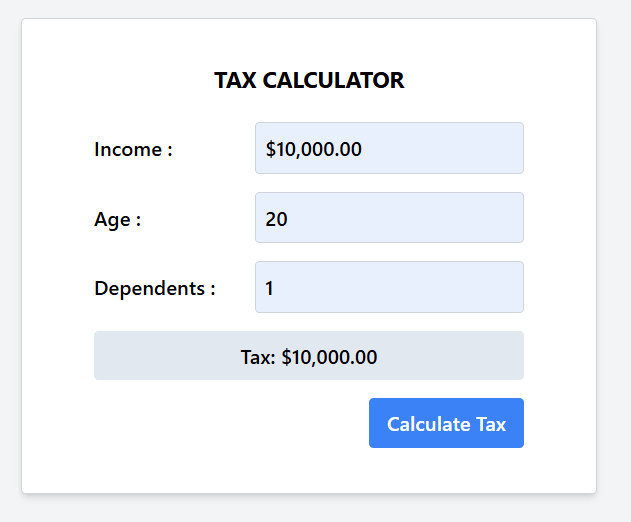

The calculateFinalTax() function recursively applies these rules and returns the final tax amount.

## TEST 2: Shipping Cost Calculator

### Overview

This application implements a shipping cost calculator with a Vue.js frontend and Pinia for state management. The application calculates the shipping cost based on destination, weight, and priority of the package. It includes a form where users can input their shipping details and receive the calculated shipping cost.

### Features

- **Destination**: Choose between "Domestic" and "International".
- **Weight**: Enter the weight of the package in kilograms (kg). the tax based on specific rules.
- **Priority**: Select the priority of shipping: "Standard", "Express", or "Priority".
- **Cost Calculation**: Automatically calculates the shipping cost based on predefined rules.
- **Formatted Output**: The calculated cost is displayed in a formatted manner

### Usage
1. Select the shipping destination from the dropdown menu.
2. Enter the weight of the package in kilograms.
3. Choose the shipping priority from the dropdown menu.
4. Click the "Calculate Shipping Cost" button to see the calculated cost.

### Code Explanation

#### Pinia Store: shippingStore
The Pinia store manages the application's state, including destination, weight, priority, and the calculation result.

#### State:
- **destinatio**n: Stores the shipping destination chosen by the user.
- **weight**: Stores the weight of the package.
- **priority**: Stores the priority of shipping.
- **result**: Stores the calculated shipping cost or error messages.

#### Actions:
calculateShippingCost(): This action calculates the shipping cost based on the provided rules.

### Main Component: ShippingCalculator.vue
- **Template:**
The template contains a form with input fields for destination, weight, and priority. It also displays the calculated shipping cost result.

- **Script:**
The script uses Vue's Composition API and Pinia for state management. It includes computed properties for binding to the Pinia store state and a method to handle calculation and display results.

- **CSS:**
The application uses Tailwind CSS for styling.

### Shipping Cost Calculation Logic

The shipping cost calculation follows these rules:

#### 1. Destination Validation:
- If the destination is not "domestic" or "international", return "Invalid destination".

#### 2. Weight Validation:

- If the weight is not a positive number, return "Invalid weight".

#### 3. Priority Validation:

- If the priority is not "standard", "express", or "priority", return "Invalid priority".

#### 4. Cost Calculation:

1.  Domestic:

- **Standard Priority**: $5 per kg
- **Express Priority**: $10 per kg
- **Priority Priority**: $20 per kg
- **Additional Cost**: $10 if weight exceeds 10 kg

2.  International:

- **Standard Priority**: $15 per kg
- **Express Priority**: $25 per kg
- **Priority Priority**: $50 per kg
- **Additional Cost**: $50 if weight exceeds 5 kg

#### 5. Formatted Output:

- The result is formatted as currency in USD.

### Router Configuration
For routing in the application, Vue Router is used to navigate between different pages. The configuration for the ShippingCalculator component is as follows:

#### Route Configuration
- Path: /shipping-calculator
- Name: ShippingCalculator
- Component: ShippingCalculator

#### How to Access
- URL: Navigate to http://localhost:8080/shipping-calculator (or your local development URL) to access the Shipping Calculator page.

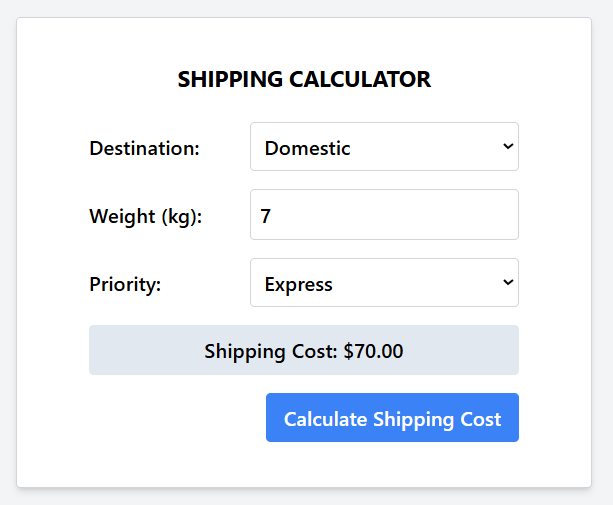

The calculateShippingCost() function applies these rules to compute the shipping cost and updates the result.

## TEST 3: Product Management Feature

### Overview
This application implements a product management feature with a Vue.js frontend and GraphQL for data operations. The application allows users to manage products with CRUD (Create, Read, Update, Delete) functionalities and calculate the total price of product categories recursively. It includes views for products, categories, and total price calculations.

### Features
#### ProductList
- **Add Product**: Form for entering new product details.
- **Edit Product**: Update existing product information.
- **Delete Product**: Remove products from the list.
- **Update Product**: Modify product details and save changes.

#### CategoryList
- **Add Category**: Form for adding new categories.
- **Edit Category**: Modify existing category details.
- **Delete Category**: Remove categories from the list.
- **Update Category**: Save changes to category details.

#### CalculateProducts
- **Calculate Total Price**: Computes the total price of products within a selected category.
- **Formatted Output**: Displays the calculated price in a formatted manner.

### Usage
**1. ProductList**

- Navigate to /products.
- Use the form to add or edit product details.
- Click on products to edit or delete them.
- Save any updates or changes.


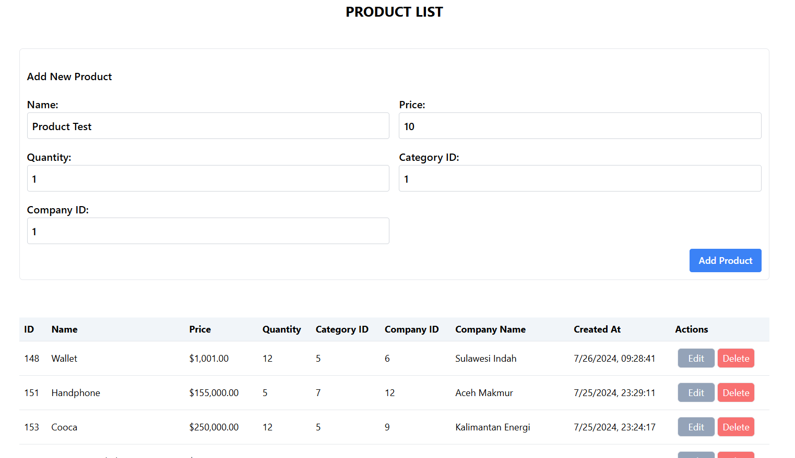

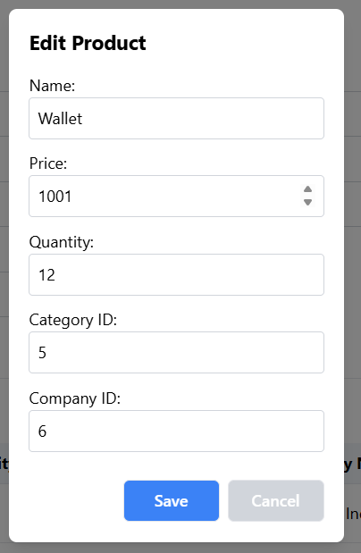

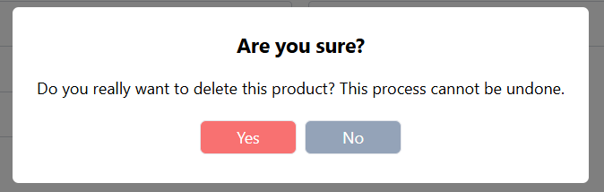

**2. CategoryList**

- Navigate to /categories.
- Use the form to add or edit categories.
- Click on categories to edit or delete them.
- Save any updates or changes.

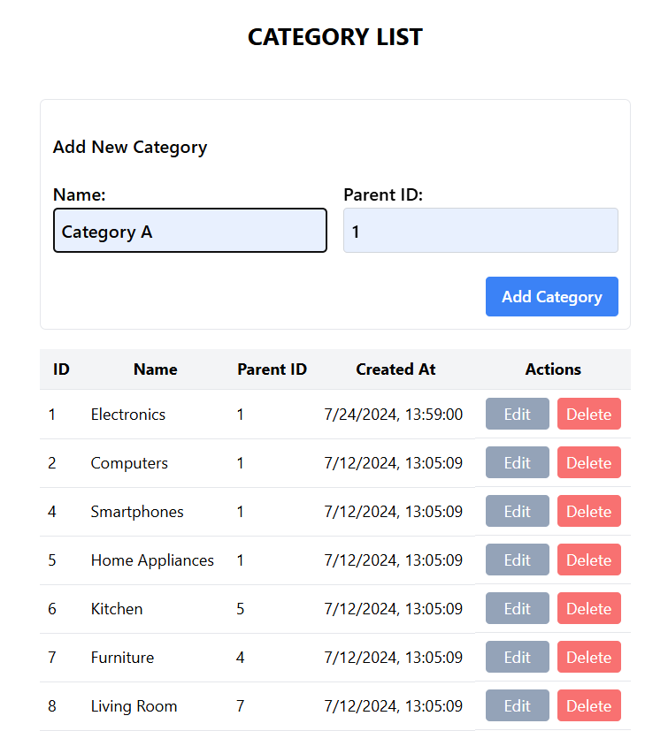

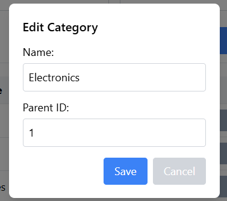

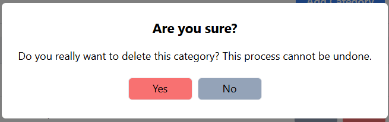


**3. CalculateProducts**

- Navigate to /product-calculator.
- Select product to add 
- Click "Calculate Total Price" to get the total price for products in the selected product.

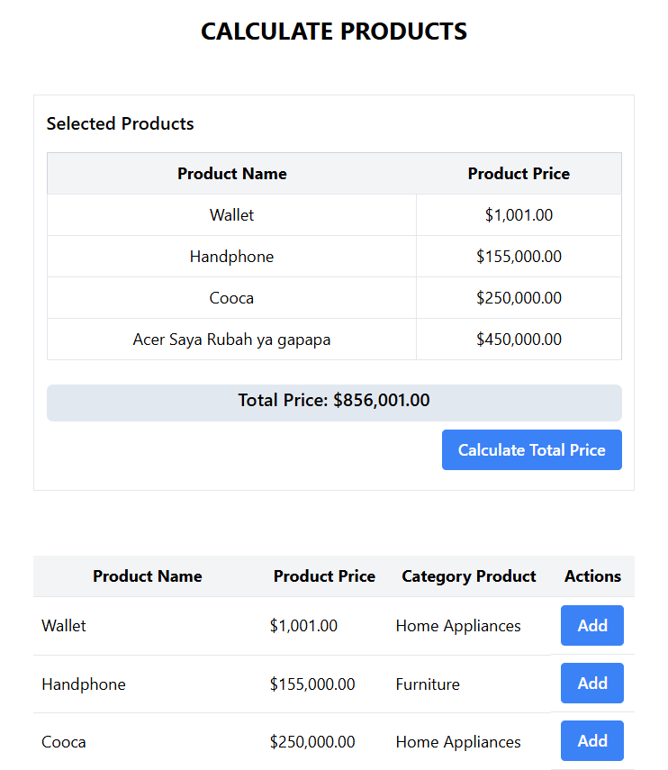

## Code Explanation
### Vue Router Configuration
The application uses Vue Router for navigating between pages. The routes are defined as follows:

```
{
  path: '/products',
  name: 'ProductList',
  component: ProductList
},
{
  path: '/categories',
  name: 'CategoryList',
  component: CategoryList
},
{
  path: '/product-calculator',
  name: 'CalculateProducts',
  component: CalculateProducts
}
```

### Pinia Store
The Pinia store manages state across the application, including product and category data, and the calculation results for the CalculateProducts page.

### State
- **products**: Stores a list of products with details.
- **categories**: Stores a list of categories.
- **calculation**: Stores the result of the price calculation.

### Actions
- addProduct(): Adds a new product.
- editProduct(): Edits existing product details.
- deleteProduct(): Deletes a product.
- updateProduct(): Updates product information.
- addCategory(): Adds a new category.
- editCategory(): Edits existing category details.
- deleteCategory(): Deletes a category.
- updateCategory(): Updates category information.
- calculateTotalPrice(): Calculates the total price of products in a selected category.

### How to Access
- ProductList: Navigate to http://localhost:8080/products (or your local development URL).
- CategoryList: Navigate to http://localhost:8080/categories.
- CalculateProducts: Navigate to http://localhost:8080/product-calculator.

## TEST 4: Interactive Map Feature

### Overview

This application includes an interactive map feature that allows users to select locations and visualize routes. The feature is built using Vue.js, Pinia for state management, and GraphQL for data operations. Users can add markers, calculate distances, and manage routing control visibility.

### Features

#### Location Selection
- **Add Location**: Allows users to add a location by selecting it on the map.
- **From Input**: The selected location's name, longitude, and latitude are displayed in the 'From' input field.
- **See Track**: This feature is used to find out the distance and route to a location.

#### Map Interaction
- **Marker Display**: Places markers on the map at database location.
- **Popup Display**: Shows information about the selected location in a popup.
- **Responsive Design**: The map and popups are designed to be responsive to different screen sizes.

#### Route Control
- **X Button**: Hides the route summary and shows the 'See Track' button when clicked.
- **O Track Button**: Allows users to view the track once the route is closed.
- **Routing Control Visibility**: Manages the visibility of routing controls on the map.

### Usage
#### Location Selection
- Navigate to the map view.
- Click on the map to select a location.
- The 'From' input field will populate with the selected location's name, longitude, and latitude.
- Click see track to find out the distance and route  location

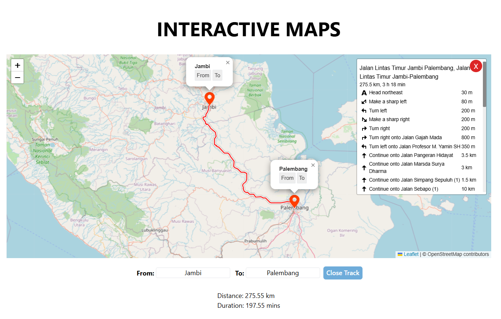


#### Map Interaction
- Click on a location marker to view the popup with location details.
- Use the 'Add' button in the popup to select the location for the 'From' input field.

#### Route Control
- Click the 'X' button to hide the route summary.
- The 'O' button will appear, allowing users to view the route again.

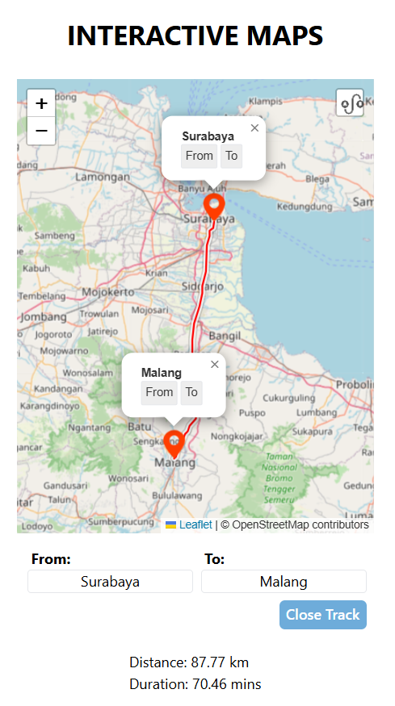

### Code Explanation
#### Vue Router Configuration
The map feature is integrated into the application using Vue Router. The route configuration might look like this:
```
{
  path: '/',
  name: 'MapView',
  component: MapView
}
```

#### Pinia Store
The Pinia store is used to manage the state for location selection, markers, and routing controls.

#### State
- locations: Stores selected locations with details.
- markers: Manages marker data for display on the map.
- routeVisible: Controls the visibility of the routing controls and summary.

#### Actions
- addLocation(): Adds a new location based on user interaction with the map.
- toggleRouteVisibility(): Toggles the visibility of the routing summary and controls.

### How to Access
- MapView: Navigate to http://localhost:8080/ to access the interactive map feature.